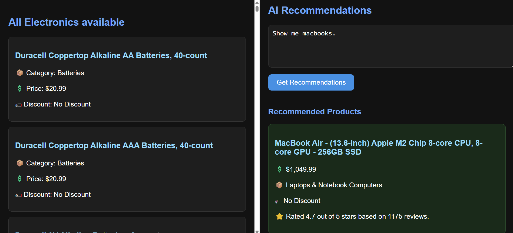
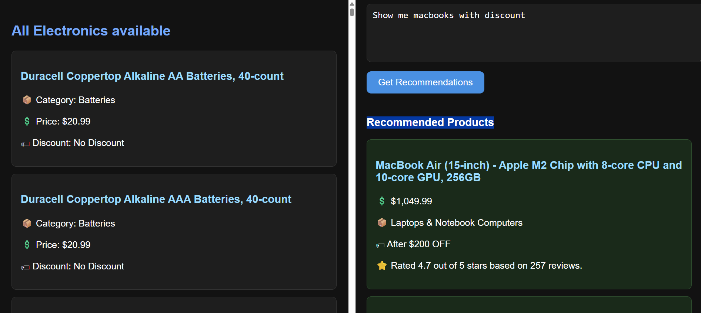

# AI Powered Reccomendation System 
 A system consisting of a simply dataset in the form of a CSV file and a model from OpenRouter as the recommendation system. 


 ## 1. Setup
 Simply copy the github repo into a folder using 
 ```
 git clone https://github.com/MarcusV210/Modern-Recommender.git
 ```
 
 Then navigate to the folder and run the react app with 
 ```npm start```

 ## 2. Layout 
 Upon start, you'll see a very basic, minimalistic setup with the left panel being the list of items in stock and right panel being the AI Recommendations. 
 
 You can search virtually anything in there and the result will be as shown below.



You can even club together conditions you need. 



## 3. Issues 
The model used is extremely basic with a very low number of parameters, therefore it sometimes understands nothing and returns an empty set of values for recommendations.
